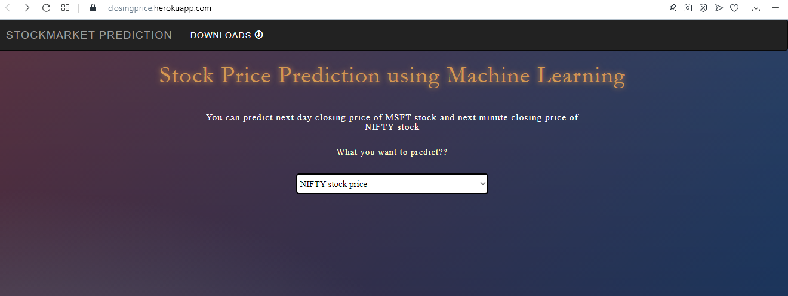
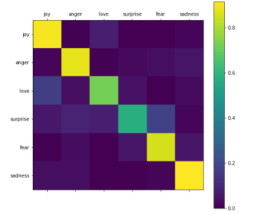

#                                                                               SHANTHOSH.V
                                                                              _My Portfolio_
                                                      **AWS Certified at Coursera, Aspiring Data Analyst, Interested in Data Psychology**                                          
                                                         

# [Project 1: Stock Market Prediction](https://github.com/shanthosh-SP/heroku-demo) 
* Created a tool that estimates the closing price of the Next day and Next hour based on the Previous day Closing Price.
* There are two datasets, One for The Next Day and Another for the Next Hour
*  Smoothen the Curve by using Moving Averages for the Better View
* Optimized LSTM to reach the best model. 
* Built a client facing API using flask 

# [Project 2: Tweets Recognizer using TensorFlow](https://github.com/shanthosh-SP/Tweet_Recoginzation) 
* In this project I created a Tweets Recoginzer model that identify the Label of the Statement given in the Data.
* Went through various Process like Tokenization , Padding , Labelling and finally the Testing Model.
* The Below Picture Decipts that the Correlation between the Labels.

For More Details: [Click Here](https://github.com/shanthosh-SP/Webpage/tree/main/images/Resume)

To View My Certifications: [Click Here](https://github.com/shanthosh-SP/Webpage/tree/main/images/Certificates)

To see the Certification for my Projects:[Click Here](https://github.com/shanthosh-SP/Webpage/tree/main/images/Projects)
